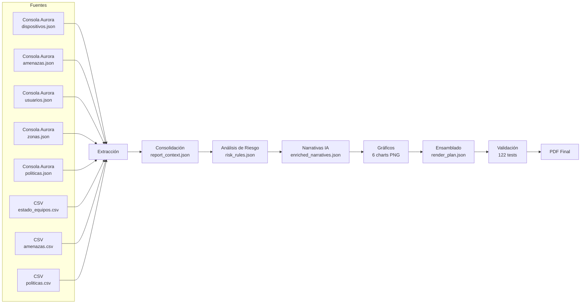

# Arquitectura del Pipeline de Reportes Aurora

## Diagrama de alto nivel



## Artefactos intermedios clave

| Artefacto | Etapa | Propósito |
|-----------|-------|-----------|
| `report_context.json` | Consolidación | Dataset unificado de toda la información del cliente en ese mes |
| `risk_rules.json` | Análisis de Riesgo | Reglas de negocio externalizadas: umbrales, pesos, criterios |
| `enriched_narratives.json` | Narrativas IA | Insights redactados (IA o stub) por cada sección |
| `render_plan.json` | Ensamblado | Plan del documento final antes de generarlo — trazabilidad |

## Reglas de negocio (risk_rules.json)

Motor de evaluación en 7 dimensiones. Cada dimensión es un objeto JSON con:

```json
{
  "dimensiones": {
    "amenazas_activas": {
      "peso": 0.25,
      "umbral_alto": 5,
      "umbral_medio": 2,
      "fuente": "amenazas.json"
    },
    "politicas_proteccion": { "peso": 0.2, ... },
    "versiones_software": { "peso": 0.15, ... },
    "conectividad": { "peso": 0.1, ... },
    "cobertura_avanzada": { "peso": 0.15, ... },
    "actividad_admins": { "peso": 0.1, ... },
    "configuracion_zonas": { "peso": 0.05, ... }
  }
}
```

Un analista de seguridad modifica pesos y umbrales sin acceso al código del pipeline.

## Modo stub determinístico

El pipeline mantiene dos caminos para generar narrativas:

- **Camino A (IA)**: LLM local con prompt estructurado.
- **Camino B (stub)**: plantilla fija que genera párrafo base desde métricas.

El stub es la línea base garantizada. El LLM es la mejora opcional.

## Orquestación

- Hasta 8 clientes en paralelo (separación por nombre de cliente en paths).
- Ventana temporal controlada: días 26-31 del mes actual o 1-5 del mes siguiente.
- Override con autorización explícita (flag `--force` + confirmación).

## Trazabilidad

Cada cifra en el PDF final puede trazarse a:
1. Sección de fuente original (JSON/CSV específico).
2. Regla aplicada en `risk_rules.json`.
3. Test que valida esa cifra.
