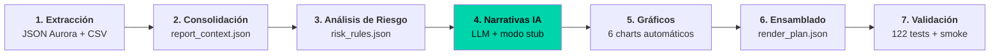

# Pipeline de Reportes Aurora — Showcase Público

> Pipeline automatizado que genera reportes mensuales de seguridad para múltiples clientes. De días a ~15 minutos con un enfoque pragmático en IA y testing exhaustivo.


## Problema

Los informes mensuales de seguridad se generaban manualmente: un analista navegaba la consola Aurora, exportaba datos a Excel, arme tablas en Word e insertaba gráficos uno por uno. El proceso era lento, inconsistente y no escalaba.

## Solución: Pipeline declarativo de 7 etapas

```text
Extracción → Consolidación → Análisis de Riesgo → Narrativas IA → Gráficos → Ensamblado → Validación
```

Cada etapa produce un artefacto intermedio verificable. El **plan intermedio** (`render_plan.json`) representa la intención del documento antes de generarlo.



## Características clave

| Característica | Detalle |
|----------------|---------|
| **Multi-cliente** | Hasta 8 clientes simultáneos en orquestación paralela |
| **Fusión multi-origen** | 5 JSON (Aurora) + 3 CSV, sin jerarquía entre fuentes |
| **Reglas externalizadas** | `risk_rules.json`: 7 dimensiones de riesgo parametrizables |
| **IA pragmática** | LLM para narrativas + modo stub determinístico (sin dependencia de API) |
| **Testing** | 122 tests (unitarios, integración, smoke) en 60-90 segundos |
| **Datos sintéticos** | Generador determinístico para tests reproducibles |
| **Trazabilidad** | Cada cifra del reporte rastrea a su fuente original |

## Stack

- Python 3.11+
- pytest + generador de datos sintéticos
- JSON/CSV processing (librerías estándar del ecosistema datos)
- Markdown templates
- GitHub Actions (CI)

## Resultados

| Métrica | Antes | Después |
|---------|-------|---------|
| Tiempo por reporte | Días | **~15 minutos** |
| Errores de copiado | Frecuentes | **Cero (validación automatizada)** |
| Consistencia entre clientes | Variable | **100%** |
| Agregar cliente nuevo | Semanas | **~2 horas** |
| Trazabilidad por cifra | No | **Completa** |

## Lecciones

1. **Artefactos intermedios verificables valen más que una caja negra.** Generar PDF desde datos crudos no escala; el plan intermedio permite regenerar barato.
2. **Reglas de negocio en archivos de configuración (no en código) dan agilidad real.** Un analista de seguridad modifica umbrales sin tocar el pipeline.
3. **El testing exhaustivo es un activo que baja el costo de cualquier cambio futuro.** 122 tests en <2 min = deploy confiable.

## Lección importante sobre IA

> El mercado busca analistas que sepan diseñar prompts y reglas que conviertan datos en **acción**, no solo en texto bonito.

El pipeline usa un modelo de lenguaje para redactar narrativas accionables por sección, pero la IA es opcional. El modo stub determinístico es la línea base; el LLM es la mejora. Nunca depender de una API para entregar el producto final.

## Docs

- [`ARCHITECTURE.md`](./ARCHITECTURE.md): diagrama detallado, artefactos, flujo de datos
- [`RUNNING.md`](./RUNNING.md): requisitos, configuración, comandos
- [`TESTING.md`](./TESTING.md): 122 tests, cobertura, generador sintético, ejecución

## Autor

**[Tu Nombre]** — Data Analyst especializado en pipelines de producción y IA pragmática.
- LinkedIn: https://linkedin.com/in/tu-usuario
- Portfolio: https://tu-usuario.github.io/marca-personal/

## Licencia

Este repositorio se comparte con fines educativos y de portfolio. El código es de ejemplo; adaptar para entornos reales.
