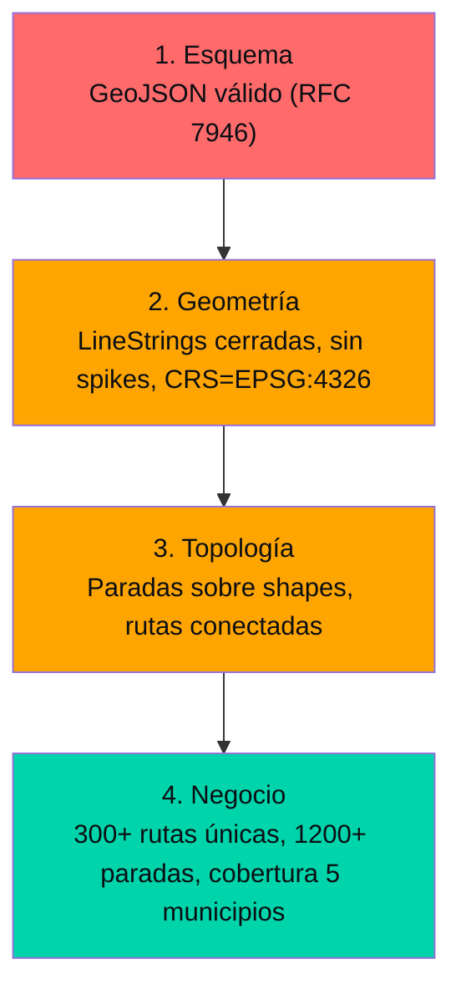

---
title: "Validación geoespacial en pipelines de datos: 4 capas que evitan que GTFS se rompa"
date: 2025-03-29
tags: ["geospatial", "validacion", "topologia", "testing"]
description: "Esquema, geometría, topología y negocio: cuatro capas de validación que garantizan que un pipeline de datos geoespaciales entregue resultados confiables."
mermaid: true
---

## El falso positivo de "se ve bien"

En datos geoespaciales, el error más peligroso no es el que se ve mal. Es el que parece correcto pero tiene una geometría inválida que nadie detectó hasta que la app de movilidad muestra una ruta que cruza el océano.

## Las 4 capas de validación

Cada capa implementa validaciones específicas:

### 1. Esquema — la validación más barata

Antes de tocar geometrías, el pipeline verifica que el archivo GeoJSON cumpla RFC 7946: tipos correctos, propiedades esperadas, coordenadas presentes. Esta capa se ejecuta en milisegundos y descarta la mayoría de los archivos mal formados.

### 2. Geometría — donde aparecen los problemas reales

Las geometrías KML oficiales traen:
- Coordenadas en orden (lon, lat) vs (lat, lon) inconsistente
- LineStrings abiertas en rutas que deberían ser cerradas
- Spikes de coordenadas: un punto que se dispara kilómetros por error de digitación

Cada shape se valida contra un umbral de distancia máxima entre puntos consecutivos.

### 3. Topología — la validación que nadie hace

No basta con que cada shape sea válido. Las paradas deben estar sobre las rutas (distancia < 50m), y las rutas deben formar una red conectada. Un router de movilidad con topología rota produce instrucciones imposibles.

### 4. Negocio — las reglas del dominio

El pipeline verifica que el dataset completo cumpla reglas del mundo real: 300+ rutas únicas, 1.200+ paradas, cobertura en los 5 municipios de Caracas. Si una regla de negocio falla, el pipeline aborta con un reporte detallado de qué capa falló y por qué.

## Lo que aprendí

1. **Las capas tempranas (esquema, geometría) son las de mayor retorno.** Detectar un archivo inválido en 1 ms evita 10 minutos de debugging después.
2. **La validación topológica no se improvisa.** Sin ella, el GTFS pasa todas las validaciones de formato pero produce rutas imposibles.
3. **Los tests geo necesitan datos sintéticos.** No puedes depender de datos reales para tests deterministas. Un generador de rutas sintéticas es tan importante como el pipeline mismo.
4. **La calidad de datos geo no es opcional.** Es la diferencia entre un proyecto de datos cívicos que funciona y uno que solo "se ve bien".
