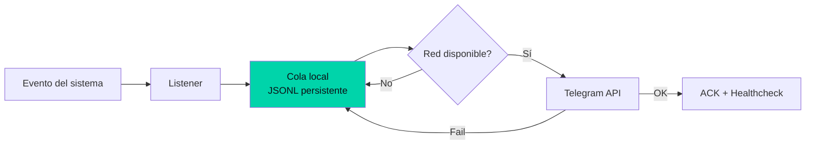

---
title: "Observabilidad en el edge: cómo monitorizar dispositivos Android sin depender de la nube"
date: 2025-07-27
tags: ["monitoring", "android", "edge-computing", "shell"]
description: "Diseño offline-first para monitoreo en dispositivos Android desatendidos: cola local persistente, retry exponencial y cero dependencias externas."
mermaid: true
---

## El problema con el monitoreo en el edge

Los dispositivos Android desatendidos —servidores caseros, gateways IoT, routers 4G— tienen un problema de observabilidad. No pueden ejecutar agents de Datadog o Prometheus. La red es intermitente. El CPU es limitado. Y cuando algo falla, no hay nadie para reiniciarlos.

El monitor tenía que cumplir tres condiciones:

1. **Zero-dependency**: nada que no venga en Termux por defecto
2. **Offline-first**: funcionar sin red, encolar mensajes, entregarlos cuando vuelva la conexión
3. **Auto-recuperable**: reiniciarse solo, sin intervención humana

## La arquitectura offline-first



### Cola local persistente

El corazón del sistema es un archivo `queue.jsonl` en /sdcard. Cada mensaje se escribe como una línea JSON con:

```json
{"id":"msg_001","text":"Alerta: batería baja","retries":0,"created":"2025-07-27T10:00:00Z"}
```

Las ventajas de JSONL:
- Persiste a reinicios y cortes de energía
- Permite lectura secuencial eficiente
- Fácil de inspeccionar con `cat` o `tail`

### Zero-dependency stack

El monitor usa exactamente tres programas externos: `curl`, `jq`, `termux-api`. Nada más. No Python, no Node, no binarios compilados. Esto garantiza que funcione en cualquier dispositivo Termux sin instalaciones adicionales.

## Lo que aprendí

1. **En el edge, la red no existe hasta que existe.** Diseñar para offline-first desde el día uno, no como una mejora posterior.
2. **JSONL es el formato ideal para colas locales en shell.** Simple, inspeccionable, recuperable. No necesitas SQLite ni Redis.
3. **Zero-dependency es una decisión arquitectónica, no una limitación.** Menos dependencias = menos puntos de falla = más tiempo entre reinicios.
4. **El healthcheck separado es la pieza que la mayoría olvida.** Sin él, ¿cómo sabes que el monitor sigue vivo?
