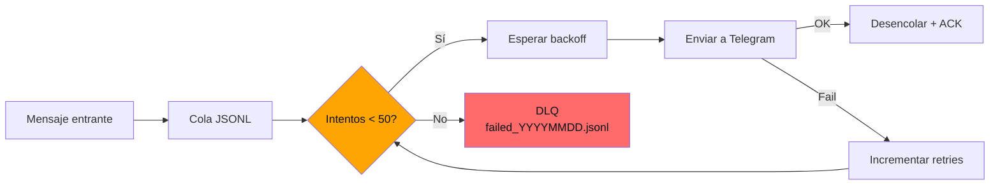

---
title: "Confiabilidad en shell: retry exponencial, dead letter queue y healthchecks en 400 líneas de bash"
date: 2025-08-03
tags: ["shell", "devops", "monitoring", "operaciones"]
description: "400 líneas de bash POSIX con retry exponencial + jitter, DLQ, healthcheck independiente y auto-recuperación. La ingeniería de confiabilidad no necesita stacks complejos."
mermaid: true
---

## Por qué 400 líneas de bash superan a 2000 líneas de Python

En Termux/Android, instalar Python requiere 100 MB y dependencias que se rompen con cada actualización. Bash, en cambio, viene instalado. Siempre funciona. Y para lógica de monitoreo —encolar, esperar, reintentar, enviar— es más que suficiente.

## El sistema de confiabilidad



### Retry exponencial con jitter

El dispatcher implementa backoff exponencial con `bc` para cálculo de punto flotante:

```bash
base_delay=1
max_delay=3600
delay=$(( base_delay * 2 ** attempt ))
# jitter: ±25% aleatorio
jitter=$(( RANDOM % (delay / 2) - delay / 4 ))
delay=$(( delay + jitter ))
# Cap a 1 hora
[ $delay -gt $max_delay ] && delay=$max_delay
```

Este patrón evita el thundering herd cuando múltiples dispositivos recuperan conectividad simultáneamente.

### Dead Letter Queue

Tras 50 intentos fallidos en 24 horas, el mensaje pasa a `failed_YYYYMMDD.jsonl` para inspección manual. Esto evita que la cola se llene con mensajes imposibles de entregar.

### Healthcheck independiente

`healthcheck.sh` corre en un proceso separado (cron de Termux cada 5 minutos):

```bash
last_ping=$(cat /tmp/monitor.heartbeat 2>/dev/null || echo 0)
now=$(date +%s)
if [ $((now - last_ping)) -gt 600 ]; then
  curl -s "https://api.telegram.org/bot$TOKEN/sendMessage"     -d "chat_id=$CHAT_ID"     -d "text=[ALERTA] Monitor sin heartbeat > 10 min"
fi
```

Si el monitor principal muere, el healthcheck lo reporta antes de que pase una hora.

## Lo que aprendí

1. **Shell POSIX es un lenguaje de producción legítimo.** 400 líneas bien estructuradas mantienen un sistema de monitoreo en docenas de dispositivos.
2. **El retry no es solo esperar y reintentar.** El backoff exponencial con jitter es lo que evita que el sistema se convierta en su propia carga.
3. **Un healthcheck no es redundante, es la única fuente de verdad.** El monitor del monitor es la pieza que cierra el bucle de confiabilidad.
4. **La DLQ no es para tristeza, es para trazabilidad.** Saber qué mensajes no se entregaron y por qué es más valioso que intentar entregarlos para siempre.
