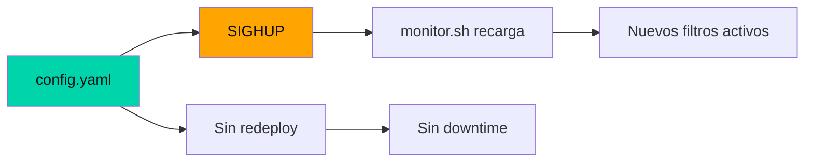

---
title: "Configuración declarativa en shell: YAML + SIGHUP para cambios en caliente sin redeploy"
date: 2025-08-10
tags: ["devops", "shell", "yaml", "configuracion"]
description: "Reglas de negocio en YAML, no en código. Cambios en caliente con SIGHUP. Cómo diseñar un sistema configurable que los operadores modifiquen sin tocar bash."
mermaid: true
---

## El problema de la configuración hardcodeada

El primer prototipo del monitor tenía los filtros de notificaciones hardcodeados en el script de bash. Cada vez que alguien quería cambiar un keyword o agregar un paquete, había que editar el script, commitear, y redeployar.

En producción, eso no escala.

## La solución: YAML como API del operador



### El archivo de configuración

```yaml
bot_token: "123456:ABC-DEF"
chat_id: "-1001234567890"
filters:
  - package: "com.whatsapp"
    keywords: ["backup", "falló"]
  - package: "com.termux"
    keywords: ["crashed", "killed"]
retry:
  max_attempts: 50
  base_delay: 1
  max_delay: 3600
healthcheck_interval: 300
```

### Carga en caliente con SIGHUP

El daemon principal registra un trap en bash:

```bash
reload_config() {
  source config.env
  echo "[$(date)] Configuración recargada" >> /var/log/monitor.log
}
trap reload_config SIGHUP
```

Cuando un operador edita config.yaml y envía:

```
kill -SIGHUP $(pidof monitor.sh)
```

El monitor recarga los filtros sin interrumpir la cola de mensajes pendientes.

### Por qué YAML y no JSON

YAML permite comentarios. En un archivo operado por humanos, los comentarios son documentación viva:

```yaml
# keywords en minúscula, el monitor normaliza automáticamente
keywords: ["backup", "falló"]
```

## Lo que aprendí

1. **La configuración es la API del operador.** Si el archivo de configuración es fácil de entender, el sistema es fácil de operar.
2. **SIGHUP es el patrón UNIX olvidado.** No necesitas Kubernetes para cambios en caliente. 30 años de UNIX ya resolvieron esto.
3. **Los comentarios en YAML son documentación que nunca se desactualiza.** A diferencia de un README, el comentario vive al lado del valor que documenta.
4. **Menos código = menos bugs.** Cada filtro hardcodeado es código que puede fallar. Cada filtro en YAML es configuración que un operador puede corregir sin abrir un PR.
