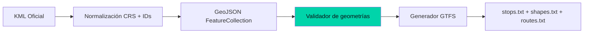

---
title: "De KML a GTFS: el pipeline que convierte datos rotos en un feed de transporte válido"
date: 2026-04-30
tags: ["geospatial", "kml", "gtfs", "nodejs", "python", "narrativa"]
description: "Cómo construir un pipeline reproducible que toma KML oficial con geometrías inválidas y produce un GTFS listo para apps de movilidad."
mermaid: true
---

## El punto de partida

El KML oficial de Caracas tenía tres problemas:
1. Coordenadas en orden inconsistente (a veces lon/lat, a veces lat/lon)
2. LineStrings abiertas en rutas que deberían ser cerradas
3. Nombres de rutas escritos sin formato estándar

El reto no era leer el KML. Era normalizarlo hasta que un router de movilidad pudiera consumirlo sin romperse.

## El pipeline

Cada etapa produce un artefacto verificable:

| Etapa | Entrada | Salida | Validación |
|-------|---------|--------|------------|
| Normalizar | KML | GeoJSON | Esquema válido |
| Validar | GeoJSON | Reporte topológico | 0 geometrías rotas |
| Generar | GeoJSON válido | GTFS | Cumplimiento GTFS spec |

## La decisión de diseño clave

GeoJSON como intermediario no es casual. Es el formato que cualquier herramienta geo puede leer y escribir. Si mañana la fuente cambia de KML a Shapefile o a una API, solo se reemplaza la primera etapa. El generador GTFS nunca se entera.

Esa separación —entre formato fuente y formato destino— es lo que hace al pipeline mantenible.
