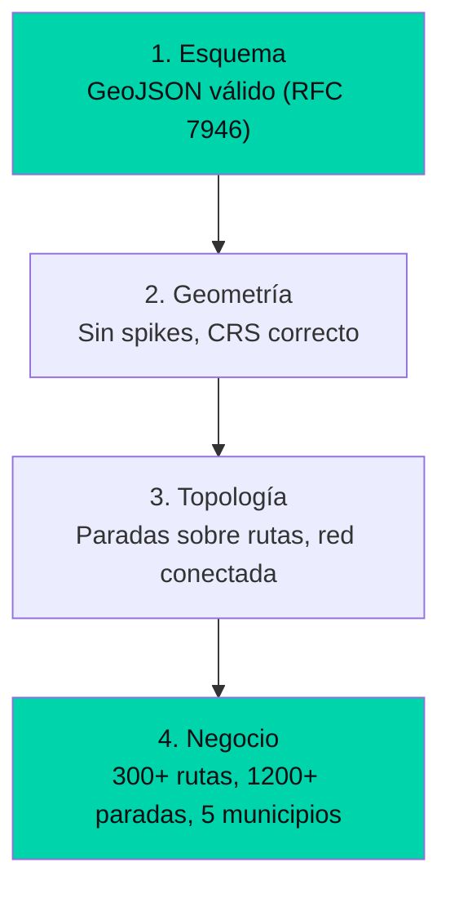

---
title: "Cuatro capas de validación que evitan que un GTFS llegue roto a producción"
date: 2026-05-14
tags: ["geospatial", "validacion", "topologia", "testing", "narrativa"]
description: "Esquema, geometría, topología y negocio. Cómo cuatro capas de validación geoespacial garantizan que un feed de transporte público funcione en cualquier app."
mermaid: true
---

## Por qué una validación no es suficiente

Un GeoJSON puede ser sintácticamente válido y contener una ruta que cruza el océano. Un shape puede tener todos los puntos en orden y no conectar con ninguna parada.

La validación geoespacial no es binaria. Tiene capas.

## Las cuatro capas

### Capa 1: Esquema (barata y rápida)
Verifica que el archivo cumpla RFC 7946. Se ejecuta en milisegundos y descarta el 90% de los archivos mal formados.

### Capa 2: Geometría (donde aparecen los problemas)
Las geometrías KML oficiales traen spikes de coordenadas y LineStrings abiertas. Cada shape se valida contra un umbral de distancia máxima entre puntos consecutivos.

### Capa 3: Topología (la que nadie hace)
Las paradas deben estar sobre las rutas (distancia < 50m). Sin esta validación, un router puede generar instrucciones imposibles.

### Capa 4: Negocio (reglas del mundo real)
300+ rutas únicas, 1.200+ paradas, cobertura en 5 municipios. Si el dataset no cumple estas reglas, algo está mal en los datos fuente.
