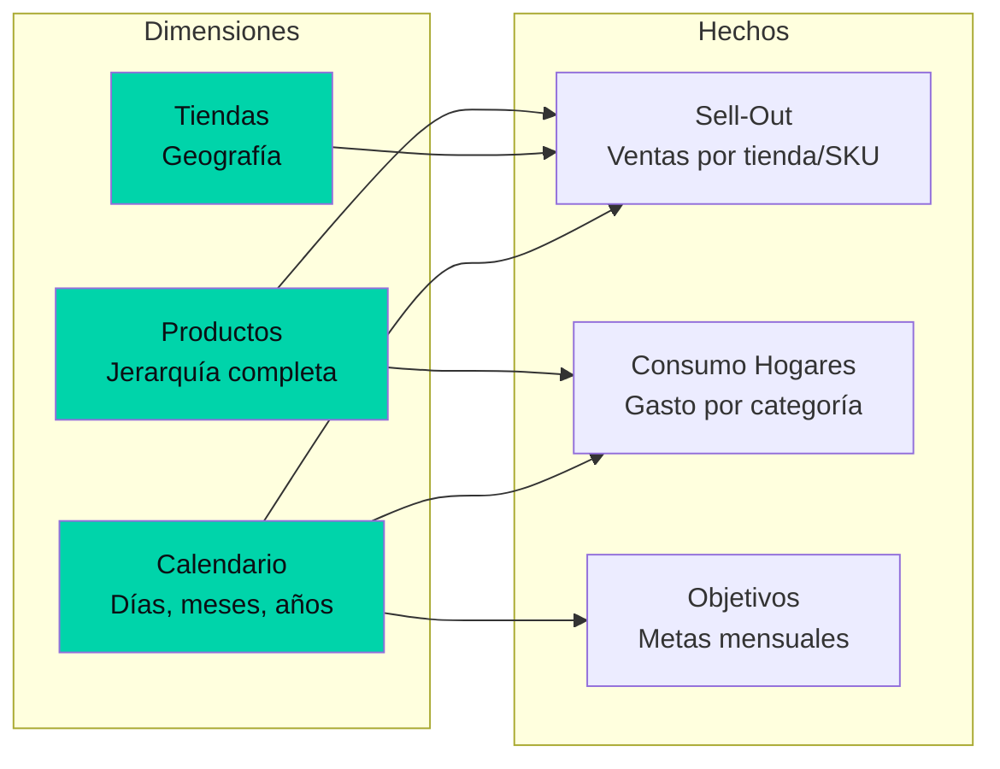

---
title: "Star Schema + DAX: cómo modelar ventas retail y consumo de hogares en Power BI"
date: 2026-06-21
tags: ["bi", "power-bi", "dax", "star-schema", "data-modeling"]
description: "Tres tablas de hechos, tres dimensiones, un esquema en estrella que permite cruzar Sell-Out vs gasto del consumidor con medidas DAX de inteligencia temporal."
mermaid: true
---

## El reto de integrar dos mundos de datos

Los datos de ventas retail (Sell-Out) y los datos de consumo de hogares viven en silos separados. Uno mide transacciones en tienda; el otro, gasto reportado por paneles de consumidores. Cruzarlos no es trivial: las granularidades son distintas, los períodos no coinciden, y las métricas se expresan en unidades diferentes.

La solución fue un modelo en estrella con tres tablas de hechos.

## El modelo



### Las tablas de hechos

Cada hecho mide un proceso de negocio diferente:

| Hecho | Granularidad | Métricas clave |
|-------|-------------|----------------|
| Sell-Out | Tienda × Producto × Día | Ventas USD, unidades, margen |
| Consumo | Categoría × Mes | Gasto total, penetración, frecuencia |
| Objetivos | Tienda × Mes | Meta USD, meta unidades |

### Las dimensiones compartidas

Las tres dimensiones se reutilizan entre hechos, permitiendo cruces que de otra forma serían imposibles:

- **Productos**: jerarquía SKU → categoría → división
- **Tiendas**: tienda → ciudad → región
- **Calendario**: día → mes → trimestre → año, con banderas de días laborales

## Las medidas DAX clave

```dax
Ventas YTD = 
  TOTALYTD(
    SUM(SellOut[VentasUSD]),
    Calendario[Fecha]
  )

Share de Ventas = 
  DIVIDE(
    SUM(SellOut[VentasUSD]),
    CALCULATE(
      SUM(SellOut[VentasUSD]),
      ALL(Productos[Categoría])
    )
  )

Índice de Oportunidad = 
  [Share de Ventas] - [Share de Gasto]
```

El `Índice de Oportunidad` es la métrica que cierra el círculo: cuando el Share de Gasto del consumidor supera el Share de Ventas de la empresa, hay demanda no capturada.

## Lo que aprendí

1. **El modelo de datos determina qué preguntas puedes responder.** Un Star Schema bien diseñado hace que medidas complejas sean expresables en 3 líneas de DAX.
2. **Las dimensiones compartidas son el habilitador del análisis cross-fuente.** Sin una dimensión de Calendario común, los YTD de Sell-Out vs Consumo serían inconsistentes.
3. **DAX no es SQL.** Las funciones de inteligencia temporal (TOTALYTD, SAMEPERIODLASTYEAR) requieren una tabla de calendario marcada como tal. Sin eso, los cálculos anuales fallan.
4. **El despivotado de metas fue la decisión técnica más importante del proyecto.** Convertir columnas anuales en filas mensuales habilitó análisis temporal que antes era imposible.
