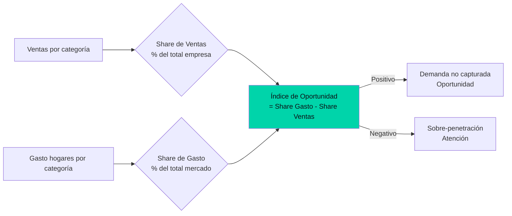

---
title: "Share de Ventas vs Share de Gasto: cómo construir un Índice de Oportunidad en Power BI"
date: 2026-06-28
tags: ["retail-analytics", "bi", "power-bi", "dax"]
description: "El cruce entre ventas reales y gasto del consumidor revela brechas de mercado que los KPIs tradicionales no muestran. Implementación en DAX con drill-through a nivel SKU."
mermaid: true
---

## El KPI que la mayoría de los reportes de retail no tienen

Los dashboards de retail suelen mostrar: ventas vs meta, crecimiento vs año anterior, distribución por tienda. Todos útiles. Pero ninguno responde la pregunta estratégica: *¿estamos capturando todo el gasto disponible del consumidor?*

Para eso sirve el cruce entre Share de Ventas y Share de Gasto.

## Cómo se construye



### Las medidas en DAX

```dax
Share Ventas =
  DIVIDE(
    SUM(SellOut[VentasUSD]),
    CALCULATE(SUM(SellOut[VentasUSD]), ALL(Categorias))
  )

Share Gasto =
  DIVIDE(
    SUM(Consumo[GastoUSD]),
    CALCULATE(SUM(Consumo[GastoUSD]), ALL(Categorias))
  )

Índice Oportunidad = [Share Gasto] - [Share Ventas]
```

Un índice positivo indica que los hogares gastan en esa categoría más de lo que la empresa vende. Hay demanda que no se está capturando.

### De la métrica a la acción

El reporte no se queda en el número. Cada categoría con Índice de Oportunidad positivo tiene un drill-through que permite navegar:

1. **Categoría** → ¿en qué subcategorías está el gap?
2. **Subcategoría** → ¿qué tiendas tienen menor cobertura?
3. **Tienda** → ¿qué SKUs específicos faltan en el surtido?

En tres clics, el analista pasa del "hay una oportunidad" al "falta el SKU X en la tienda Y".

## Lo que aprendí

1. **El verdadero benchmark no es la meta, es el mercado.** Tus objetivos internos pueden estar subestimando el potencial real de la categoría.
2. **La alineación mercado-ventas es un proxy de estrategia.** Si vendes menos de lo que el mercado gasta, hay una decisión de surtido, distribución o precio que tomar.
3. **El drill-through no es un lujo, es la herramienta que cierra el círculo.** Sin él, la métrica informa pero no acciona.
4. **Power BI permite esto en un solo modelo.** Tres hechos, tres dimensiones, y las medidas DAX adecuadas. No hace falta un data warehouse separado.
