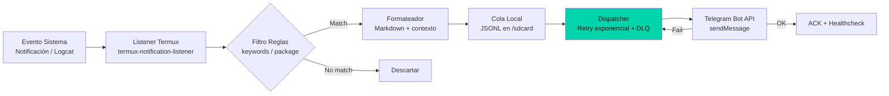

## El problema real

Tengo un servidor casero en un Android viejo conectado a internet por un router 4G. Cuando el router se reinicia, cuando la batería se agota, o cuando Termux crashea —necesito saberlo. Pero en el edge móvil no hay Datadog, no hay Prometheus, no hay agente de monitoreo.

Solo hay un teléfono con Termux, acceso a la API de Telegram, y la necesidad de que alguien avise cuando algo falla.

## Arquitectura: Monitor → Alerta → Retry

## Principios de diseño

### 1. Offline-first: la red no existe hasta que existe

Cada evento se escribe a una cola local en JSONL antes de intentar enviarlo. Si la red falla (y va a fallar), los mensajes esperan en disco. El dispatcher procesa en orden FIFO cuando la conectividad regresa.

### 2. Healthcheck independiente

El monitor tiene un healthcheck separado que corre en cron. Cada 5 minutos verifica que el listener principal esté vivo. Si no responde, envía una alerta de emergencia. Es el "monitor del monitor".

### 3. Retry exponencial con dead letter queue

| Intento | Espera | Si falla |
|---------|--------|----------|
| 1 | 1s | Reintentar |
| 2 | 2s | Reintentar |
| 3 | 4s | Reintentar |
| 4 | 8s + jitter | Reintentar |
| ... | ... | ... |
| 50 | 1h (max) | DLQ |

Después de 24h sin éxito, el mensaje se archiva en un archivo separado para inspección manual.

## Lecciones transferibles

1. **En el edge, la red no existe hasta que existe.** Diseña para offline-first: cola local, retry infinito, healthcheck separado.
2. **Shell POSIX es suficiente.** 400 líneas de bash bien testeadas superan a 2000 líneas de Python con dependencias rotas en Termux.
3. **Observabilidad del monitor = monitor del monitor.** Healthcheck independiente es la única forma de saber si el monitor vive.
