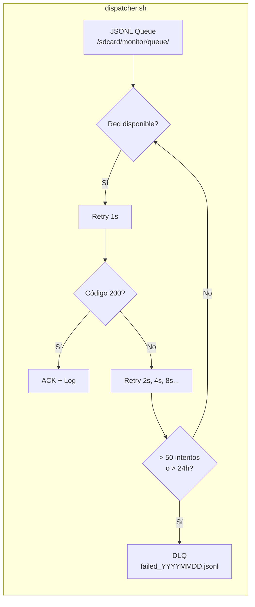

## El problema real

El monitor Android necesita funcionar en condiciones adversas: red intermitente, batería limitada, sin root, sin Node.js, sin Python. La única garantía es que `bash`, `curl` y `jq` están disponibles.

En ese entorno, cada línea de código debe justificar su existencia. No hay espacio para frameworks ni abstracciones innecesarias.

## La arquitectura en 400 líneas



### Componentes

| Script | Líneas | Responsabilidad |
|--------|--------|-----------------|
| `monitor.sh` | ~120 | Listener de notificaciones, trap SIGTERM, reinicio automático |
| `dispatcher.sh` | ~180 | Cola persistente, retry exponencial, DLQ |
| `healthcheck.sh` | ~50 | Heartbeat cada 5 min, alerta si > 10 min sin ping |
| `install.sh` | ~50 | Bootstrap, permisos, systemd (termux-services) |

### Retry exponencial con jitter

```bash
# Pseudocódigo del dispatcher
delay=1
max_delay=3600
attempts=0
while [ $attempts -lt 50 ]; do
  if curl -s -o /dev/null -w "%{http_code}" -X POST "$url" \
         -d "$payload" | grep -q 200; then
    log "ENTREGADO: $id"
    rm "$msg_file"
    break
  fi
  sleep "$(( delay + RANDOM % (delay / 4) ))"
  delay=$(( delay * 2 ))
  [ $delay -gt $max_delay ] && delay=$max_delay
  attempts=$(( attempts + 1 ))
done
```

## Por qué 400 líneas y no 2000

Cada alternativa evaluada agregaba complejidad sin valor real en este contexto:

| Alternativa | Problema |
|-------------|----------|
| Python + requests | Dependencias rotas tras actualización de Termux |
| Node.js + axios | 50MB+ de node_modules en almacenamiento limitado |
| Go compilado | Sin compilador cross-platform para Android viejo |
| Shell + curl | Funciona siempre, 0 dependencias |

## Lecciones transferibles

1. **Shell POSIX es suficiente.** 400 líneas de bash bien testeadas superan a 2000 líneas de Python con dependencias rotas.
2. **El retry exponencial no es opcional.** En redes intermitentes, el backoff con jitter evita el thundering herd y maximiza la entrega.
3. **La cola persistente es la base de la confiabilidad.** JSONL en disco = los mensajes sobreviven a reinicios, crashes y pérdida de red.
