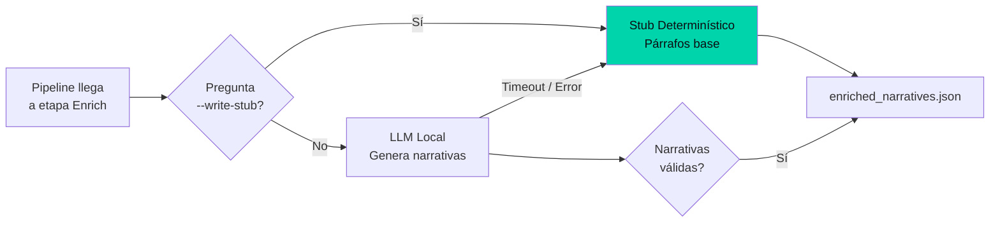

## El problema real

El pipeline Aurora genera narrativas en lenguaje natural para cada sección del informe de seguridad. Idealmente, un modelo de lenguaje redacta insights como _"El 40% de los equipos no tiene EDR activo, lo que representa un riesgo alto"_.

Pero en producción, los modelos de lenguaje fallan: timeout, API caída, respuesta vacía, contenido alucinado. Si el pipeline depende del LLM para generar el informe, la disponibilidad del sistema queda secuestrada por un servicio externo.

## La solución: stub determinístico



El stub genera párrafos que preservan la estructura del documento:

```text
[Narrativa generada automáticamente]
Sección: Resumen de Amenazas
Nivel de riesgo: [ALTO / MEDIO / BAJO]
Indicador principal: {métrica más crítica}
Recomendación: {recomendación basada en reglas de negocio}
```

Cada narrativa incluye:
- Nivel de riesgo detectado.
- Indicador que lo dispara.
- Recomendación priorizada.

## IA opcional, calidad obligatoria

| Escenario | Con LLM | Sin LLM (stub) |
|-----------|---------|----------------|
| Narrativas | Personalizadas, fluidas | Estructuradas, correctas |
| Tono | Natural | Robótico pero funcional |
| Disponibilidad | Depende del LLM | 100% |
| Riesgo de alucinación | Bajo (prompt controlado) | Cero (datos, no lenguaje) |
| Tiempo de etapa | ~1s | < 100ms |

## Por qué este patrón funciona

El stub determinístico no es un "plan B" improvisado. Es un diseño deliberado donde la IA es un componente **adjunto**, no una dependencia crítica. El pipeline se probó primero con `--write-stub` durante semanas. Solo cuando las narrativas base estaban validadas se activó el LLM como mejora.

## Lecciones transferibles

1. **La IA debe ser un componente desacoplable.** Si el LLM falla, el pipeline continúa con narrativas determinísticas. El informe se entrega igual.
2. **Primero sin IA, luego con IA.** Validar el flujo sin el modelo evita que la complejidad del LLM enmascare errores del pipeline.
3. **La predictibilidad gana a la creatividad en producción.** Un stub que siempre genera la misma estructura vale más que un LLM que a veces alucina.
