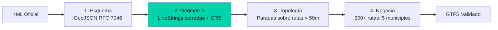

## El problema real

El gobierno de Caracas publica rutas de transporte en KML. Pero esos archivos tienen geometrías inválidas: LineStrings que se cruzan a sí mismas, coordenadas fuera del municipio, paradas que no están sobre ninguna ruta. Si conviertes ese KML directamente a GTFS, las apps de navegación muestran rutas imposibles.

El pipeline no podía solo transformar formato. Tenía que certificar calidad geoespacial.

## Validación geoespacial en 4 capas

| Capa | Qué valida | Cómo falla | Acción |
|------|-----------|------------|--------|
| 1. Esquema | GeoJSON es válido RFC 7946 | FeatureCollection inválida | Abortar con reporte |
| 2. Geometría | LineStrings cerradas, CRS=EPSG:4326 | Self-intersections, spikes | Corregir coordenadas |
| 3. Topología | Paradas están sobre rutas | Distancia > 50m | Mover parada a ruta |
| 4. Negocio | 300+ rutas, 1200+ paradas | Cobertura insuficiente | Alerta al curador |

## El hallazgo que definió el diseño

Al validar las primeras 50 rutas, descubrimos que el 30% de las paradas estaban a más de 100 metros de la ruta que supuestamente servían. La causa: las rutas KML estaban digitalizadas a mano sobre mapas satelitales sin ajuste fino.

La solución no fue "corregir los datos" en el pipeline. Fue implementar un reporte de calidad que le dijera al curador humano exactamente qué paradas mover y a dónde. El pipeline no reemplaza al curador —le da herramientas para trabajar mejor.

## Stack de validación

| Herramienta | Propósito |
|-------------|-----------|
| `@tmcw/togeojson` | Parseo KML → GeoJSON |
| `geojson-validation` | Validación esquema |
| Turf.js | Cálculos topológicos (distance, along) |
| Jest | 300+ aserciones automatizadas |

## Lecciones transferibles

1. **La validación topológica no es opcional.** KML oficial trae geometrías inválidas; sin tests geo el GTFS resultante rompe routers.
2. **El formato intermedio (GeoJSON) es el contrato.** Parser y generador desacoplados permiten cambiar fuentes sin tocar la lógica GTFS.
3. **Pipeline no reemplaza curador humano, lo potencia.** El reporte de calidad es la interfaz entre el algoritmo y la persona que conoce el territorio.
