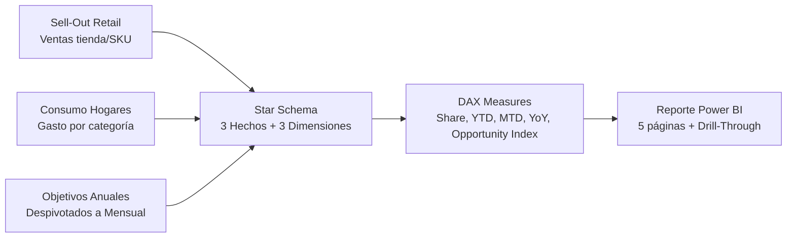

## El problema real

En retail, el Sell-Out (venta real al consumidor) y el Consumo en Hogares (gasto reportado por paneles) rara vez coinciden. Una categoría puede tener alta participación de ventas pero baja participación de gasto —o viceversa. Esa brecha revela oportunidades de mercado.

El problema es que ambas fuentes viven en silos. El equipo comercial mira ventas; el equipo de marketing mira consumo. Nadie cruza las dos tablas.

## Arquitectura: Star Schema + DAX



### Tablas de hechos

| Tabla | Granularidad | Registros | Fuente |
|-------|-------------|-----------|--------|
| Sell-Out | Tienda x SKU x Mes | ~50K | Retail |
| Consumo Hogares | Categoría x Mes | ~500 | Panel consumidores |
| Objetivos Anuales | Tienda x Mes | ~200 | Comercial |

### Dimensiones compartidas

| Dimensión | Jerarquía |
|-----------|-----------|
| Productos | Categoría > Marca > SKU |
| Tiendas | Región > Zona > Tienda |
| Calendario | Año > Mes > Día |

## La medida que cambió la conversación

El **Índice de Oportunidad** cruza Share de Ventas (Sell-Out) contra Share de Gasto (Consumo):

Cuando el gasto del hogar supera la venta de la empresa, emerge una oportunidad: la demanda existe, pero no está siendo capturada.

```dax
Opportunity Index = 
VAR ShareVentas = [Sales Share]
VAR ShareGasto = [Spend Share]
RETURN
    DIVIDE(ShareGasto - ShareVentas, ShareVentas)
```

Un índice positivo indica categorías donde el consumidor gasta más de lo que la empresa vende. Ahí están las decisiones tácticas: ajustar surtido, reforzar distribución, redirigir inversión promocional.

## Lecciones transferibles

1. **El modelo de datos es la estrategia.** Un Star Schema bien diseñado hace que medidas complejas como Share vs Gasto se expresen en pocas líneas de DAX.
2. **Los objetivos no son metadatos.** Despivotar metas anuales de columnas a filas habilita análisis temporal (YTD, MTD) que antes era imposible.
3. **La trazabilidad importa.** Drill-Through desde el Resumen Ejecutivo hasta el SKU individual mantiene al analista conectado con los datos.
