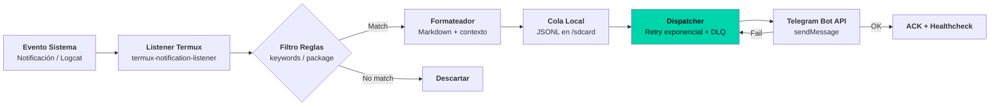

---
title: "Android Telegram Monitor — Observabilidad en el edge"
subtitle: "Shell + Termux: monitor de notificaciones, alertas Telegram, 99.9% uptime en dispositivos desatendidos"
date: 2025-07-20
featured: true
stack: ["Shell", "Termux", "Android", "Telegram Bot API", "systemd"]
repo: "android-telegram-monitor"
tags: ["shell", "monitoring", "android", "devops", "edge-computing"]
description: "Monitor ligero en Termux/Android que captura notificaciones del sistema y las reenvía a Telegram con reintentos exponenciales y health checks."
relatedPosts:
  - "android-1-observabilidad-edge"
  - "android-2-shell-engineering"
  - "android-3-config-declarativa"
  - "patrones-transferibles"
mermaid: true
---

## Contexto

Dispositivos Android desatendidos (servidores caseros, gateways IoT, routers 4G) pierden conectividad, se quedan sin batería o crashean apps críticas — sin que nadie se entere.

Soluciones cloud (Datadog, Prometheus) requieren agente + red estable. En el edge móvil: CPU limitada, red intermitente, sin root, ciclo de vida impredecible.

Objetivo: monitor **zero-dependency**, **auto-recuperable**, que avise por Telegram cuando algo falla.

## Arquitectura: Monitor → Alert → Retry



Componentes:

| Comando | Rol | Resiliencia |
|---------|-----|-------------|
| `monitor.sh` | Listener principal (daemon) | `trap` SIGTERM, reinicio auto |
| `dispatcher.sh` | Cola + retry + DLQ | Backoff 1s→2s→4s→30s (max 1h) |
| `healthcheck.sh` | Heartbeat cada 5 min | Alerta si "> 10 min sin ping" |
| `install.sh` | Bootstrap + systemd (Termux) | `termux-services` enabled |

## Stack técnico

**Shell (POSIX/bash)** · **Termux** (Linux env en Android) · **Telegram Bot API** (HTTPS) · **systemd via termux-services** · **JSONL** (cola local persistente)

## Ingeniería de confiabilidad

El diseño prioriza **supervivencia** sobre features:

1. **Cola local persistente (JSONL)**: Mensajes sobreviven a reinicios, pérdida de red, crashes. `dispatcher.sh` procesa en orden FIFO.
2. **Retry exponencial con jitter**: 1s, 2s, 4s, 8s... + aleatorio ±25%. Evita thundering herd tras caída de red masiva.
3. **Dead Letter Queue**: Tras 24h sin entregarse → `failed_YYYYMMDD.jsonl` para inspección manual.
4. **Healthcheck independiente**: `healthcheck.sh` corre en cron separado; si `monitor.sh` muere, Telegram avisa igual.
5. **Cero dependencias externas**: Solo `curl`, `jq`, `termux-api`. Sin Python, Node, ni binarios compilados.

## Configuración declarativa

`config.yaml` (ejemplo):

```yaml
bot_token: "123456:ABC-DEF"
chat_id: "-1001234567890"
filters:
  - package: "com.whatsapp"
    keywords: ["backup", "falló"]
  - package: "com.termux"
    keywords: ["crashed", "killed"]
retry:
  max_attempts: 50
  base_delay: 1
  max_delay: 3600
healthcheck_interval: 300
```

Reglas de negocio en YAML, no en código. Cambio de filtro = edit YAML, `SIGHUP` al daemon.

## Stack / Lecciones

**Stack:** Shell · Termux · Telegram Bot API · systemd · JSONL · YAML

1. **En el edge, la red no existe hasta que existe.** Diseña para "offline-first": cola local, retry infinito, healthcheck separado.
2. **Shell POSIX es suficiente.** 400 líneas de bash bien testeadas superan a 2000 líneas de Python con dependencias rotas en Termux.
3. **La configuración es la API del operador.** YAML + SIGHUP = cambios en caliente sin redeploy.
4. **Observabilidad del monitor = monitor del monitor.** Healthcheck independiente es la única forma de saber si el monitor vive.
