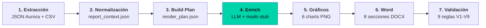

---
title: "Pipeline de Reportes Aurora: automatización de informes de seguridad en producción"
subtitle: "7 clientes, 7 etapas declarativas, 200+ tests, ~15 minutos end-to-end"
date: 2024-10-01
featured: true
stack: ["Python", "pytest", "JSON", "Markdown", "LLM local"]
repo: "pipeline-aurora-showcase"
tags: ["pipeline", "data-engineering", "testing", "ia"]
description: "Sistema automatizado que genera reportes mensuales de seguridad para múltiples clientes, reemplazando un proceso manual de días por uno de ~15 minutos con más de 200 tests y reglas de negocio externalizadas."
mermaid: true
relatedPosts:
  - "aurora-1-manual-a-pipeline"
  - "aurora-2-datos-sucios-fusion"
  - "aurora-3-ia-deterministico"
  - "aurora-4-testing-como-activo"
  - "patrones-transferibles"
---

## Contexto

En la empresa, la entrega de informes mensuales de seguridad a clientes era un proceso artesanal: un analista navegaba la consola Aurora, exportaba datos a Excel, armaba tablas en Word, insertaba gráficos manualmente y repetía el flujo para cada cliente. El resultado era inconsistente, lento y frágil ante cualquier cambio en las métricas.

El objetivo del proyecto era construir un pipeline reproducible que generara un documento completo y validado automáticamente.

## Arquitectura: 7 etapas declarativas



Cada etapa produce un artefacto intermedio verificable. El **plan intermedio** (`render_plan.json`) representa la intención del documento antes de generarlo, permitiendo regenerar el DOCX sin reprocesar todo el pipeline.

## Timing por fase

| Fase | Script | Output | Duración |
|------|--------|--------|----------|
| F0 · Verificar crudos | `scripts/check_raw_data.py` | exit_code {0,1,2} | ~1s |
| F1 · Recolectar | `scripts/fetch_report_data.py` | 5 JSON + 3 CSV | 5-15s |
| F2 · Normalizar | `scripts/normalize_context.py` | `report_context.json` | 5-15s |
| F3 · Build Plan | `pipeline/cli/build_plan.py` | `render_plan.json` | 5-15s |
| F4 · Enrich | `pipeline/cli/enrich.py` | `enriched_narratives.json` | ~1s |
| F5 · Gráficos | `pipeline/cli/render_charts.py` | 6 charts PNG | 15-30s |
| F6 · Word | `pipeline/cli/build_docx.py` | `Reporte_Aurora_*.docx` | 60-90s |
| F7 · Validar | `pipeline/cli/validate.py` | `validation.log` | ~1s |

**End-to-end:** ~2 minutos por cliente.

## Datos multi-origen

- **5 archivos JSON** desde la consola Aurora: dispositivos, amenazas, usuarios, zonas, políticas.
- **3 archivos CSV** complementarios: estado de equipos, amenazas, políticas.

Ninguna fuente prevalece sobre la otra. Si una falla (ej: cliente deja de enviar CSV), el sistema continúa con la información disponible sin detenerse.

## Motor de reglas externo (Risk Engine)

El Risk Engine evalúa 7 dimensiones de seguridad en paralelo durante la Fase 3 (Build Plan), cada una con una ponderación específica:

| Dimensión | Peso | Evalúa |
|-----------|------|--------|
| A · Amenazas activas | 30 pts | Incidentes abiertos, severidad, evolución mensual |
| B · Políticas de protección | 25 pts | Cobertura de políticas por dispositivo |
| C · Versiones de software | 15 pts | End-of-life, parches críticos |
| D · Conectividad | 10 pts | Equipos sin conexión reciente |
| E · Cobertura EDR | 10 pts | Equipos sin endpoint detection |
| F · Actividad de admins | 5 pts | Accesos anómalos, cuentas privilegiadas |
| G · Configuración de zonas | 5 pts | Segmentación, zonas sin monitoreo |

El archivo `risk_rules.json` define umbrales y ponderaciones. Los analistas de seguridad modifican estos valores sin tocar el código del pipeline.

## IA pragmática: Narrativas + fallback determinístico

La sección de narrativas del informe utiliza un modelo de lenguaje para redactar insights en lenguaje natural. Cada narrativa indica:

- Nivel de riesgo detectado.
- Indicador que lo dispara (ej: "40% de equipos sin EDR activo").
- Recomendación priorizada.

El sistema integra el modelo de forma opcional. Cuando la IA está deshabilitada o el servicio no disponible, un **modo stub determinístico** (`--write-stub`) genera párrafos base que preservan la estructura del documento. Esta decisión evita que la dependencia externa se convierta en un punto único de falla en producción.

## Multi-cliente: orquestación paralela

El pipeline orquesta hasta 8 clientes en paralelo, con los siguientes controles:

- **Ventana temporal**: días 26 a 31 del mes actual o 1 a 5 del siguiente. Fuera de este rango: `ValueError`. Override vía `REPORTING_MONTH_OVERRIDE`.
- **Paralelismo**: hasta 8 clientes simultáneos. Más de 8: fallback secuencial.
- **Resiliencia**: si un cliente falla, los demás continúan. Resumen consolidado al final.

## Quality gates: 9 reglas de validación V1-V9

Cada documento generado pasa por 9 validaciones automáticas antes de considerarse entregable:

| Regla | Verifica |
|-------|----------|
| V1 | Esquema de `report_context.json` |
| V2 | Cobertura de datos por fuente |
| V3 | Consistencia de métricas entre fases |
| V4 | Formato y existencia de gráficos |
| V5 | Longitud y tono de narrativas |
| V6 | Integridad de secciones del documento |
| V7 | Reglas de negocio contra umbrales |
| V8 | Coherencia cross-cliente |
| V9 | Smoke test end-to-end |

Además, **más de 200 tests automatizados** cubren: unitarios (esquemas, reglas, transformaciones), integración (flujo completo con datos sintéticos) y end-to-end (entrada → DOCX final). Ejecución completa: **60-90 segundos**.

```python
pytest tests/unit/        # Esquemas, reglas, narrativas, gráficos (~140 tests)
pytest tests/integration/ # Flujo completo con datos sintéticos (~60 tests)
pytest tests/e2e/smoke.py # End-to-end: entrada → DOCX final (~10 tests)
```

## Resultados

| Métrica | Antes | Después |
|---------|-------|---------|
| Tiempo por reporte | Días | **~15 minutos** |
| Errores de copiado | Frecuentes | **Cero** |
| Consistencia entre clientes | Variable | **100%** |
| Agregar cliente nuevo | Semanas | **~2 horas** |
| Trazabilidad por cifra | No | **Completa** |

## Stack / Lecciones

**Stack:** Python 3.x · pytest + datos sintéticos · JSON/CSV como artefactos intermedios · LLM local (opcional, con stub determinístico) · Risk engine configurable via JSON

1. **Los artefactos intermedios verificables valen más que una caja negra.** Generar salida final desde datos crudos sin trazabilidad no escala.
2. **Las reglas de negocio en archivos de configuración (no en código) dan agilidad real.** Los analistas modifican umbrales sin tocar el pipeline.
3. **El testing exhaustivo es un activo que baja el costo de cualquier cambio futuro.** El despliegue de cambios es confiable porque los tests corren en <2 minutos.
4. **La IA debe ser un componente desacoplable.** Si el LLM falla, el pipeline continúa con narrativas sintéticas. El informe se entrega igual.
