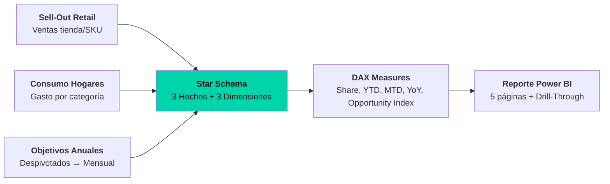

---
title: "Sell-Out vs Consumo de Hogares — Alineación de Mercado en Power BI"
subtitle: "Integración de ventas retail + consumo hogareño: Star Schema, DAX, Índice de Oportunidad"
date: 2026-06-14
featured: true
stack: ["Power BI", "DAX", "Power Query (M)", "Star Schema"]
repo: "Sell-Out-vs-Consumo-de-Hogares"
tags: ["bi", "power-bi", "dax", "data-modeling", "retail-analytics"]
description: "Ejercicio de BI analista: integra Sell-Out retail + consumo hogareño en Star Schema con DAX. Detecta brechas de mercado (Sales Share vs Spend Share) y evalúa cumplimiento de metas con YTD/MTD/YoY."
relatedPosts:
  - "sell-out-1-star-schema-dax"
  - "sell-out-2-bi-engineering"
  - "patrones-transferibles"
mermaid: true
---

## Contexto

En retail, el **Sell-Out** (venta real al consumidor final) y el **Consumo en Hogares** (gasto reportado por paneles de consumidores) rara vez coinciden. La diferencia revela oportunidades de mercado: categorías donde la demanda del consumidor supera la oferta de la empresa.

El reto era integrar ambas fuentes —más los objetivos comerciales anuales— en un solo modelo analítico que permitiera cruzar ventas contra gasto y detectar brechas de mercado de forma reproducible.

## Arquitectura: Star Schema + DAX

El modelo se diseñó bajo un **esquema en estrella** para garantizar rendimiento y claridad:

- **Tablas de Hechos:** Sell-Out (ventas por tienda/producto), Consumo de Hogares, Objetivos Comerciales.
- **Tablas de Dimensiones:** Productos (con jerarquías completas), Tiendas (geografía), Calendario estandarizada.

## Estructura del reporte

| Página | Propósito |
|--------|-----------|
| 1 · Resumen Ejecutivo | KPIs de Ventas USD, evolución mensual vs meta, distribución territorial |
| 2 · Análisis Sell-Out | Productos líderes (Top 10), desempeño de marcas, crecimiento por categorías |
| 3 · Desempeño vs Objetivos | Cumplimiento por tienda, brechas, acciones comerciales priorizadas |
| 4 · Alineación de Mercado | **Share de Ventas vs Share de Gasto** → Índice de Oportunidad |
| 5 · Exploración Avanzada | Drill-Through desde agregado hasta nivel SKU/transacción mensual |

## Stack técnico

**Power BI** · **DAX** (Data Analysis Expressions) para medidas estratégicas · **Power Query (M)** para ETL, limpieza y despivotado de metas · **Star Schema** como modelo de datos

## Desafíos técnicos superados

1. **Calidad de datos:** Se auditó y reconstruyó la dimensión de Productos — faltaban códigos de barras presentes en las fuentes de ventas.
2. **Inteligencia de Tiempo:** Implementación de medidas DAX robustas para cálculos YTD, MTD y comparativas interanuales (YoY).
3. **Optimización de Metas:** Los objetivos anuales venían en columnas (estructura no analítica). Se transformaron mediante despivotado en Power Query a una base relacional eficiente.

## Insight estratégico: Alineación de Mercado

El núcleo del reporte es la página 4: cruza el **Share de Ventas** de la empresa contra el **Share de Gasto** del consumidor en cada categoría. Cuando el gasto del hogar supera la venta, emerge un **Índice de Oportunidad** que señala dónde la demanda no está siendo capturada.

Esta métrica permite decisiones tácticas inmediatas: ajustar surtido, reforzar distribución, o redirigir inversión promocional hacia las categorías con mayor gap.

## Stack / Lecciones

**Stack:** Power BI · DAX · Power Query (M) · Star Schema · Despivotado de metas

1. **El modelo de datos es la base de todo.** Un Star Schema bien diseñado (3 hechos, 3 dimensiones) hace que medidas complejas como Share vs Gasto sean expresables en pocas líneas de DAX.
2. **Los objetivos son datos, no metadatos.** Al despivotar los targets anuales de columnas a filas, se habilitó análisis temporal (YTD, MTD) que antes era imposible.
3. **La trazabilidad importa.** Con Drill-Through desde el Resumen Ejecutivo hasta el SKU individual, el analista nunca pierde el hilo entre el KPI y la transacción que lo genera.
4. **BI engineering es ingeniería.** La calidad de datos, el modelado y las medidas DAX requieren el mismo rigor que un pipeline de datos: testing, consistencia, y reglas de negocio externalizadas.
